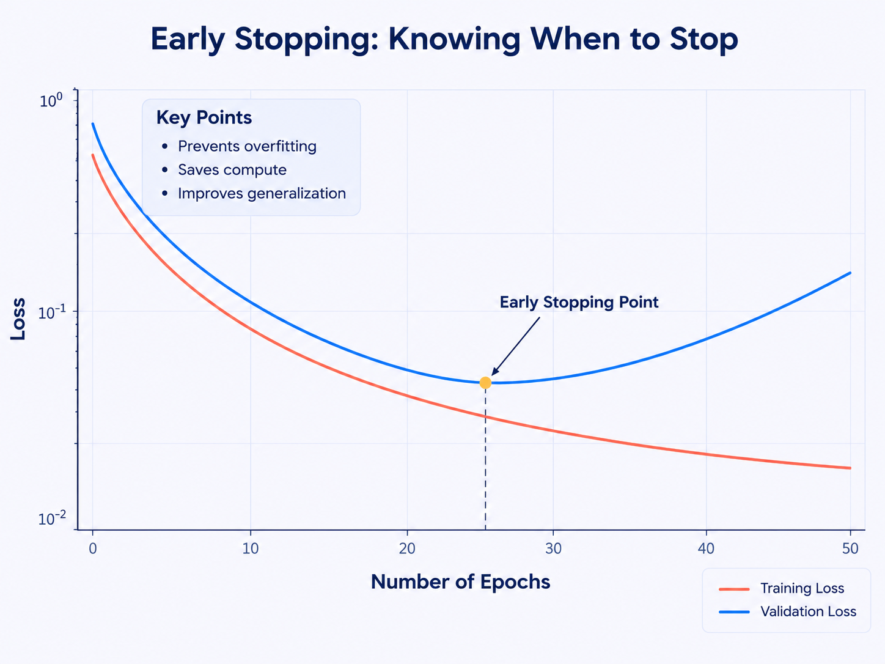

<div style="display:flex; flex-direction:row; align-items:center; gap:30px; width:100%; margin:30px 0;">

  <div style="flex:1; min-width:0; padding:18px 20px; border-left:4px solid #7657e8; border-radius:0 10px 10px 0; background:#f0ecff;">

    <p style="margin:0 0 8px;">
      🧠 <strong>EARLY STOPPING</strong>
    </p>

    <p style="margin:0;">
      Early stopping is a <strong>regularization technique</strong>
      that <strong>prevents overfitting</strong> by stopping training
      when <strong>validation performance stops improving</strong>.
    </p>

  </div>

  <div style="flex:1; min-width:0; text-align:center;">

    

  </div>

</div>

---

### 🧪 Keras

```python
early_stop = callbacks.EarlyStopping(
    monitor="val_loss",
    patience=5,
    min_delta=1e-4,
    mode="min",
    restore_best_weights=True
)

model.fit(
    x_train, y_train,
    validation_data=(x_val, y_val),
    epochs=200,
    batch_size=64,
    callbacks=[early_stop]
)
````

 ### ⚙️ Key Parameters

 | Parameter | Meaning |
| --- | --- |
| `monitor="val_loss"` | 👀 Monitor validation loss |
| `patience=5` | ⏳ Wait 5 epochs without improvement |
| `min_delta=1e-4` | 🔎 Minimum change considered an improvement |
| `mode="min"` | 📉 Lower value is better |
| `restore_best_weights=True` | ⭐ Restore weights from the best epoch |

> ⭐ **Important:** In the example, Epoch 3 has the lowest `val_loss (0.40)`, so `restore_best_weights=True` restores the **Epoch 3 weights**.

---

 ### 🧩 Can Be Combined With

 **Dropout** → Randomly removes neurons\
 **L2 / Weight Decay** → Penalizes large weights\
 **Data Augmentation** → Creates varied training examples\
 **Early Stopping** → Stops when validation performance worsens

 > 🎯 **Takeaway:**\
>  **Train → Monitor Validation → Detect Overfitting → Stop → Restore Best Weights**
